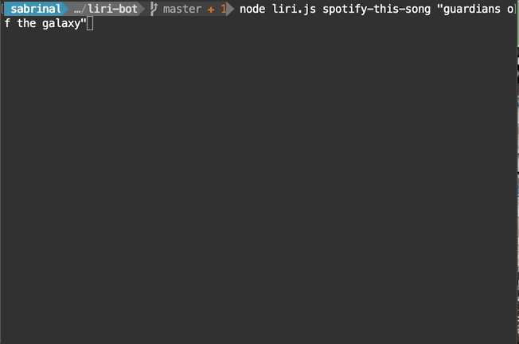
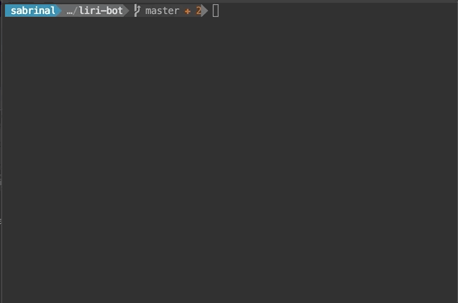
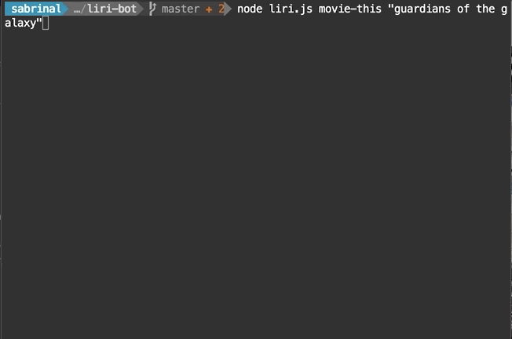
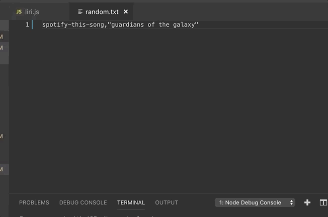
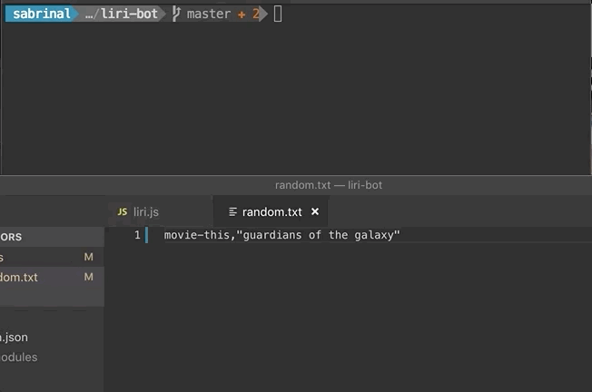
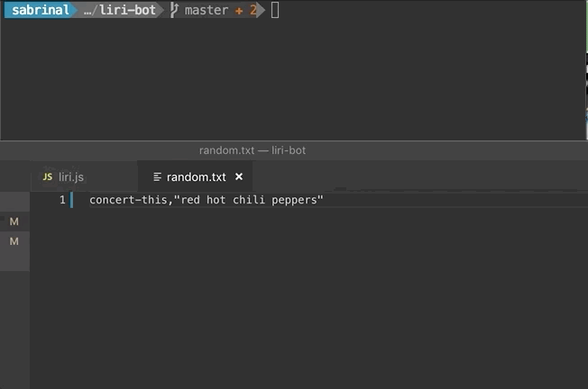

# liri-bot
Meet LIRI

LIRI is like iPhone's SIRI. However, while SIRI is a Speech Interpretation and Recognition Interface, LIRI is a Language Interpretation and Recognition Interface. LIRI will be a command line node app that takes in parameters and gives you back data.


## Environment Setup

To use LIRI, you need to create a file named `.env`, add the following to it, replacing the values with your API keys (no quotes) once you have them:

```js
# Spotify API keys

SPOTIFY_ID=your-spotify-id
SPOTIFY_SECRET=your-spotify-secret
```

## What does LIRI do

- search Spotify for songs

`node liri.js spotify-this-song '<song name here>'`



- Bands in Town for concerts

`node liri.js concert-this <artist/band name here>`



- OMDB for movies

`node liri.js movie-this '<movie name here>'`



- Do above based on txt input file

`node liri.js do-what-it-says`









## APIs used in this bot:

   * [Node-Spotify-API](https://www.npmjs.com/package/node-spotify-api)

   * [Axios](https://www.npmjs.com/package/axios)
   
   * [OMDB API](http://www.omdbapi.com) 
   
   * [Bands In Town API](http://www.artists.bandsintown.com/bandsintown-api)

   * [Moment](https://www.npmjs.com/package/moment)

   * [DotEnv](https://www.npmjs.com/package/dotenv)

